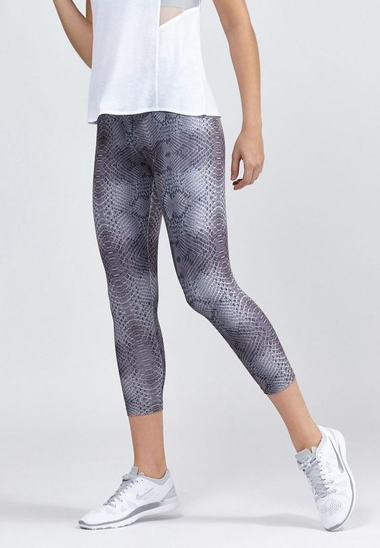

## Before the Lab

Bring your current wardrobe inventory, or take one during the Lab if you
have not already.

## In the Lab

| Time | Block |
| --- | --- |
| 0:00–0:05 | Introduction — this week's topic, tied back to last Lab |
| 0:05–0:25 | Activity 1 (groups of 4): Ranking exercise |
| 0:25–0:35 | Presentation / class discussion of Activity 1 |
| 0:35–0:50 | Activity 2: Assemble three outfits |
| 0:50–0:55 | Discussion / debrief (pairs) |
| 0:55–1:00 | Wrap-up, reflection prompt reminder |

**Introduction.** Last week's schedule handled maintenance — the routine
stuff that just needs a frequency and a fallback. This week is about the
one decision a schedule can't make for you: what you actually put on, and
whether it fits the room you're about to walk into.

**Activity 1 (groups of 4): Ranking exercise.** Each group works from the
same five outfits:

1. Off-duty casual

   

   A collared shirt-jacket, cuffed jeans, and boots that have never seen
   polish — dressed for a look, not a room.

   *Photo: May Lee (Flickr), CC BY-SA 2.0, via Wikimedia Commons.*

2. Head-to-toe loungewear

   

   A long-sleeve top, pyjama trousers, and bare feet — no attempt made at
   shoes.

   *Photo: Alexander Moore / Rydale Clothing, CC BY 2.0, via Wikimedia
   Commons.*

3. Overdressed

   

   A full suit and a tie loud enough to be seen from the back row, worn
   somewhere that did not call for either.

   *Photo: AndLikeThings, CC BY-SA 2.0, via Wikimedia Commons.*

4. Gym kit

   

   Tank top, leggings, trainers — straight off the gym floor, no time
   taken to change.

   *Photo: metromela (Flickr), CC BY-SA 2.0.*

5. The typical CS student

   

   The unofficial CS-student uniform — hoodie, jeans, and a bag slung
   across the body, giving away nothing about which side of an all-nighter
   this particular CS student is on.

   *Photo: SEAMENSHIE Gusahoixa, CC BY-SA 4.0, via Wikimedia Commons.*

Each group is assigned one occasion from the list below and ranks the
five outfits best-fit to worst-fit for it:

- Your thesis defence, rescheduled twice already, now happening at 8 a.m.
  on a public holiday.
- Meeting your in-laws for the first time, over a lunch you cannot leave
  until dessert.
- Your younger cousin's birthday party, where an aunt has already
  announced you as "the fun one" for the afternoon.
- The interview for the internship you have already told everyone you
  got.
- Jury duty, in the exact week you also have three assignments due.
- A group project meeting called for 7 p.m. on a Friday, by the one
  member who never replies to messages otherwise.

Then the occasion rotates to a different group's assignment and the same
five outfits are ranked again from scratch — the point is that the
ranking changes with the occasion, not that any outfit is objectively
good or bad.

**Presentation:** Each group presents the one ranking they disagreed on
most — the outfit whose placement genuinely split the group — for the
class to weigh in on.

**Activity 2: Assemble three outfits.** Individually, from your own
wardrobe, assemble three outfits — one for a lecture, one for a friend's
birthday party, one for the gym — and justify each in one sentence against
its occasion. This is a rehearsal for
[Assignment 1](/assessments/assignment-1-makeover/), not the submission.

**Discussion / debrief (pairs):** Show your three outfits to one other
student; they offer one suggestion per outfit — a swap, an addition, or an
objection.

**Wrap-up:** Keep these three outfits and their justifications —
[Assignment 1](/assessments/assignment-1-makeover/) asks for the same
shape, with photographic evidence attached.

## Afterwards

Keep the three outfits and their justifications;
[Assignment 1](/assessments/assignment-1-makeover/) asks for the same
shape with photographic evidence attached.
